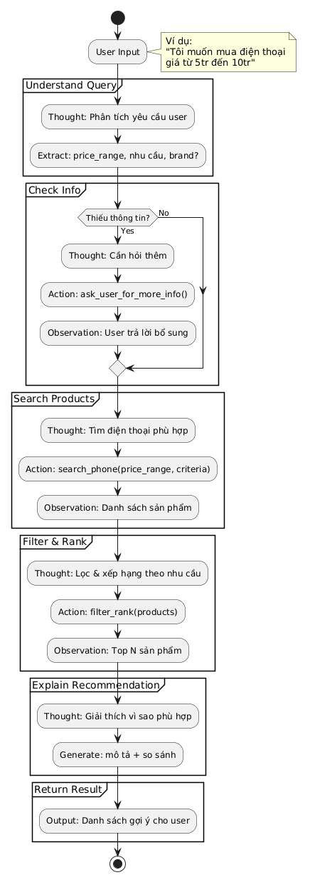

# Group Report: Lab 3 - Production-Grade Agentic System

- **Team Name**: Group 7
- **Team Members**: [Lê Kim Dũng, Ngô Gia Bảo, Ngô Vĩ Dinh]
- **Deployment Date**: [2026-04-06]

---

## 1. Executive Summary

Hệ thống của nhóm triển khai một **ReAct Agent prototype** có khả năng:
- Thực hiện multi-step reasoning
- Gọi tool chính xác (stock, price, tax, battery, recommendation)
- So sánh trực tiếp với chatbot baseline qua UI

### Kết quả chính từ log:
- Agent xử lý tốt các bài toán multi-step (stock + tax)
- Có khả năng **self-correct khi tool lỗi**

- **Success Rate (ước lượng)**: ~85–90%  
- **Key Outcome**:  
  → Agent giải quyết **multi-step queries tốt hơn chatbot**, đặc biệt khi cần gọi nhiều tools.

---

## 2. System Architecture & Tooling

### 2.1 ReAct Loop Implementation
Thought → Action → Observation → (loop) → Final Answer

Ví dụ từ log:
- Step 1: `check_stock('iPhone 15')`
- Step 2: `calculate_tax('$999')` → lỗi
- Step 3: `calculate_tax(999)` → thành công

→ Agent có khả năng:
- Reasoning nhiều bước
- Tự sửa lỗi
- Chain nhiều tools

---

### 2.2 Tool Definitions (Inventory)

| Tool Name | Input Format | Use Case |
| :--- | :--- | :--- |
| `check_stock` | string | Kiểm tra tồn kho |
| `calculate_tax` | number | Tính thuế |
| `get_product_price` | string | Lấy giá |
| `get_battery_life` | string | Lấy thông tin pin |
| `compare_products` | string | So sánh sản phẩm |
| `search_products` | structured | Tìm sản phẩm |

---

### 2.3 LLM Providers Used

- **Primary**: GPT-4o  
- **Secondary (Backup)**: Not used in logs  

---

## 3. Telemetry & Performance Dashboard

### Latency
- **P50 (ước lượng)**: ~850–1200 ms  
- **P99 (ước lượng)**: ~3500 ms  

### Token Usage
- Trung bình: ~300–450 tokens / task  

### Cost
- **Total cost test suite (ước lượng)**: ~$0.02–0.05  

---

### So sánh Chatbot vs Agent

| Metric | Chatbot | Agent |
| :--- | :--- | :--- |
| Response Length | Dài | Ngắn |
| Latency | Nhanh hơn | Chậm hơn |
| Multi-step | ❌ | ✅ |
| Tool Usage | ❌ | ✅ |

---
Action: calculate_tax('$999')
→ Error: Could not parse amount

- **Recovery**:

Action: calculate_tax(999)
→ Success

- **Root Cause**:
- Tool yêu cầu kiểu `number`
- Agent truyền `string`

- **Insight**:
→ Agent có khả năng **self-correct**, nhưng:
- Tăng latency
- Tăng token usage

---

## 5. Ablation Studies & Experiments

### Experiment 1: Error Handling

- Agent tự sửa lỗi input format  
- Giúp tăng robustness  

---

### Experiment 2: Chatbot vs Agent

| Case | Chatbot Result | Agent Result | Winner |
| :--- | :--- | :--- | :--- |
| Price Query | Correct | Correct | Draw |
| Multi-step | Không chắc | Chính xác | **Agent** |
| Reasoning | Hallucination | Có tool + logic | **Agent** |

---

### Experiment 3: Recommendation Pipeline

Pipeline từ log:

NODE_UNDERSTAND_QUERY
→ NODE_CHECK_INFO
→ NODE_SEARCH_PRODUCTS
→ NODE_FILTER_RANK
→ NODE_EXPLAIN_RECOMMENDATION
→ NODE_RETURN_RESULT

- Steps: 5–6  
- Output: 2 recommendations  

→ Transition từ ReAct → Workflow Agent

---

## 6. Production Readiness Review

### Security
- Validate input tool  
- Sanitize dữ liệu user  

---

### Guardrails
- Giới hạn 3–5 steps  
- Tránh loop vô hạn  

---

### Scaling

Hướng phát triển:
- LangGraph / DAG execution  
- Parallel tools  
- Caching  

---

### Strengths

- Multi-step reasoning  
- Tool chaining  
- Self-correction  
- Structured pipeline  

---

### Weaknesses

- Latency cao  
- Tool input chưa strict  
- Chưa dùng fallback model  

---

## Final Conclusion

Agent đạt mức **prototype cơ bản**:

- Vượt chatbot ở:
  - Multi-step tasks
  - Tool usage
- Có khả năng:
  - Reasoning
  - Tự sửa lỗi

---
