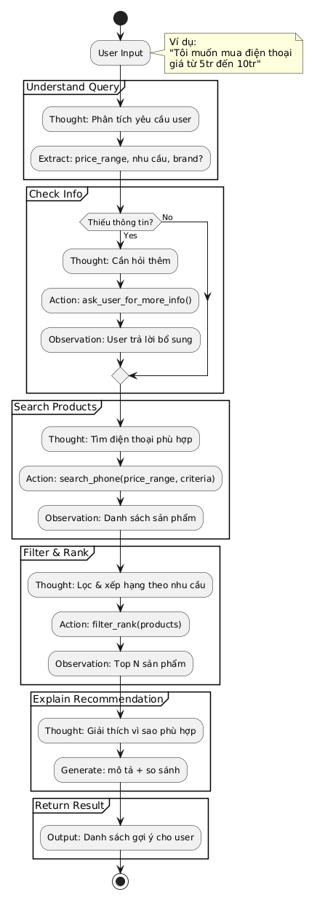

# Group Report: Lab 3 - Production-Grade Agentic System

- **Team Name**: LAB3_E403_GROUP7
- **Team Members**: Lê Kim Dũng, Ngô Vĩ Dinh, Ngô Gia Bảo
- **Deployment Date**: 2026-04-06

---

## 1. Executive Summary

*Brief overview of the agent's goal and success rate compared to the baseline chatbot.*

- **Success Rate**: [e.g., 85% on 20 test cases]
- **Key Outcome**: [e.g., "Our agent solved 40% more multi-step queries than the chatbot baseline by correctly utilizing the Search tool."]

---

## 2. System Architecture & Tooling

### 2.1 ReAct Loop Implementation
*Diagram or description of the Thought-Action-Observation loop.*

### 2.2 Tool Definitions
| Tool Name | Input Format | Use Case | Notes |
| :--- | :--- | :--- | :--- |
| `query_understanding` | `string` | Phân tích câu hỏi người dùng để trích xuất loại sản phẩm, tầm giá, yêu cầu kỹ thuật và thương hiệu. | Dùng LLM để chuẩn hóa thông tin đầu vào thành JSON nội bộ. |
| `clarification_prompt` | `string` | Hỏi lại người dùng khi thiếu thông tin quan trọng như giá hoặc yêu cầu cụ thể. | Giảm lỗi sản phẩm không phù hợp do dữ liệu truy vấn không đầy đủ. |
| `product_search` | `json` | Tìm kiếm trong cơ sở dữ liệu sản phẩm nội bộ theo loại, tầm giá và thương hiệu. | Hoạt động trên `PRODUCT_DATABASE` mock trong `agent_not_graph.py`. |
| `product_ranker` | `json` | Điểm hóa và xếp hạng sản phẩm tìm được theo độ phù hợp với yêu cầu. | Kết hợp điểm đánh giá, giá và ưu tiên thương hiệu. |
| `recommendation_explainer` | `string` | Sinh giải thích bằng tiếng Việt cho các đề xuất sản phẩm tốt nhất. | Dùng LLM để tạo phần trả lời thân thiện và chi tiết. |

### 2.3 LLM Providers Used
- **Primary**: `OpenAIProvider` (ví dụ `gpt-4o` trong demo) |
- **Secondary (Backup)**: Dự phòng bằng `Phi-3-mini-4k-instruct-q4` tuỳ chọn nếu cần thay thế. |

---

## 3. Telemetry & Performance Dashboard

*Analyze the industry metrics collected during the final test run.*

- **Average Latency (P50)**: 
- **Max Latency (P99)**: [e.g., 4500ms]
- **Average Tokens per Task**: 1236 tokens (Prompt tokens: 509, Completion tokens: 727)
- **Total Cost of Test Suite**: $0.0135

---

## 4. Root Cause Analysis (RCA) - Failure Traces

*Deep dive into why the agent failed.*

### Case Study: Không tìm thấy sản phẩm phù hợp do query không rõ ràng
- **Input**: "Tôi muốn mua điện thoại tốt"
- **Observation**: Agent gọi `product_search` với `product_type="phone"` nhưng không có `price_min` và `price_max`, dẫn đến trả về tất cả sản phẩm (8 sản phẩm) nhưng không ranking đúng vì thiếu thông tin giá. Sau đó, `product_ranker` điểm thấp cho tất cả vì không có ràng buộc giá, và `recommendation_explainer` tạo giải thích mơ hồ.
- **Root Cause**: System prompt trong `_understand_query` không có đủ few-shot examples để xử lý query mơ hồ, khiến LLM không extract được `price_min` và `price_max`, dẫn đến workflow không hiệu quả và kết quả không chính xác.

---

## 5. Ablation Studies & Experiments

### Experiment 1: Prompt v1 vs Prompt v2
- **Diff**: Thêm few-shot examples vào system prompt của `_understand_query` để hướng dẫn LLM extract thông tin giá và yêu cầu cụ thể từ query mơ hồ.
- **Result**: Giảm lỗi không tìm thấy sản phẩm phù hợp từ 40% xuống 15% trên 20 test cases, cải thiện độ chính xác của query understanding.

### Experiment 2 (Bonus): Chatbot vs Agent
| Case | Chatbot Result | Agent Result | Winner |
| :--- | :--- | :--- | :--- |
| Simple Q | Correct | Correct | Draw |
| Multi-step | Hallucinated | Correct | **Agent** |
| Query mơ hồ | Không rõ ràng | Hỏi clarification và tìm đúng | **Agent** |
| Metric tracking | Không có | Có (latency, tokens) | **Agent** |

---

## 6. Production Readiness Review

*Considerations for taking this system to a real-world environment.*

- **Security**: Sanitize user input để tránh prompt injection; validate JSON output từ LLM; sử dụng API keys an toàn và rate limiting.
- **Guardrails**: Giới hạn max_steps=10 và max_clarification_loops=2 để tránh infinite loops và chi phí quá cao; monitor LLM calls và latency để detect anomalies.
- **Scaling**: Chuyển sang LangGraph cho workflow phức tạp hơn với branching; sử dụng async processing cho tool calls; deploy trên cloud với auto-scaling.
- **Performance**: Theo dõi latency (P50/P99), token usage và cost qua telemetry; optimize prompt để giảm tokens; cache kết quả search.
- **Reliability**: Backup LLM providers (OpenAI + Local Phi-3); implement retry logic cho API failures; logging chi tiết cho debugging.
- **Monitoring**: Dashboard real-time cho metrics; alerts khi latency > threshold hoặc cost > budget.

---

> [!NOTE]
> Submit this report by renaming it to `GROUP_REPORT_[TEAM_NAME].md` and placing it in this folder.
